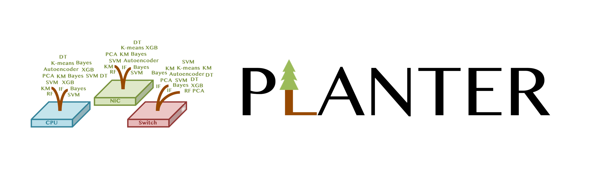

# Planter

[](https://opensource.org/licenses/Apache-2.0)


## Access to Planter Code

### Planter 0.1.0 has been released via [Link](https://github.com/In-Network-Machine-Learning/Planter) under [In-Network-Machine-Learning](https://github.com/In-Network-Machine-Learning).

## Introducing Planter
Planter is a modular framework for realizing one-click in-network machine learning algorithms. All you need to provide to Planter are a configuration file (```Name_data.py```) and a dataset. Planter will take it from there and offload your machine learning classification task into a programmable data plane. This is the artifact for the paper "Planter: Rapid Prototyping of In-Network Machine Learning Inference" in SIGCOMM CCR (with early [arXiv](https://arxiv.org/pdf/2205.08824.pdf) version named "Automating In-Network Machine Learning".) 

💡 **Please check Planter's user document** [PDF](./Docs/Planter_User_Document_v0.1.0.pdf) (strongly recommended). 

## Planter's Availability

**Planter 0.1.0 has been released via [Link](https://github.com/In-Network-Machine-Learning/Planter) under [In-Network-Machine-Learning](https://github.com/In-Network-Machine-Learning).** Planter paper will appear in the next volume of CCR [[pdf](https://eng.ox.ac.uk/media/zetja3ek/zheng24planter.pdf)]. Meanwhile, if you're interested in this work and find anything unclear in the ArXiv paper, please feel free to contact me at ```changgang.zheng@eng.ox.ac.uk```. **We are welcoming collaborations.** It can be exciting to collaborate, if you think in-network machine learning is helpful to your research or use case. If there are any potential interests, please feel free to contact my supervisor ```noa.zilberman@eng.ox.ac.uk``` and me ```changgang.zheng@eng.ox.ac.uk```.

## License

The files are licensed under Apache License: [LICENSE](./LICENSE). The text of the license can also be found in the LICENSE file.

## Applications
Please access the Planter project's history and recent applications through the [link](./Docs/Projects.md). If your work uses Planter, please kindly email us if possible. We will include your latest publication or project in the application list.

## Citation
If you use this code, please cite our [paper](https://eng.ox.ac.uk/media/zetja3ek/zheng24planter.pdf):

```
@article{zheng2024automating,
  title={{Planter: Rapid Prototyping of In-Network Machine Learning Inference}},
  author={Zheng, Changgang and Zang, Mingyuan and Hong, Xinpeng and Perreault, Liam and Bensoussane, Riyad and Vargaftik, Shay and Ben-Itzhak, Yaniv and Zilberman, Noa},
  journal={ACM SIGCOMM Computer Communication Review},
  year={2024}
}
```


## Acknowledgments

The following people contributed to this project: Changgang Zheng, Mingyuan Zang, Xinpeng Hong, Liam Perreault, Riyad Bensoussane, Shay Vargaftik, Yaniv Ben-Itzhak, and Noa Zilberman. In addition, Peng Qian contributed to this repository. This work was partly funded by VMware and the EU Horizon SMARTEDGE (101092908, UKRI 10056403). We acknowledge support from Intel and NVIDIA. 
